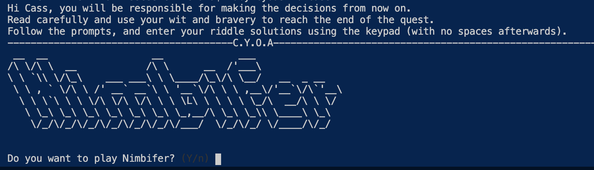

### Software Development Plan
Choose Your Own Adventure: *Nimbifer*
Developer: Cassandra Zara


**Table of Contents**
- Statement of Purpose & Scope
- Features
- User Interaction & Experience 
- Flow Chart
- Install Instructions 
- Help File 
- Developer Operations

### T1A2-1    Statement of Purpose and Scope

Choose Your Own Adventure: Nimbifer is a single-player adventure game with a written format that runs in the terminal. In this adventure game, the user assumes the role of the protagonist in an interactive story driven by exploration and puzzle-solving. The user directs the flow of the adventure through choices that result in a branching narrative, with an overarching goal of reaching a final endpoint as motivation. 'Nimbifer' follows the genre's emphasis on story and character, and draw's heavily from other narrative-based media. The user is prompted to input their choices via menu selection, and they solve riddles via key selection to move through stages of the game. Some choices will lead to ‘death’ and exit from the story without achieving the overarching goal upon which users will have an option to replay. The user ‘wins’ when they have reached the final stage and retrieved a phrase that ties into the narrative. 

The application has been developed with the purpose of gameplay, with primary purpose the completion of the Nimbifer quest. It was designed as part of a resurgent trend in the late 2000s of adventure games as new platforms became available, along with physical escape rooms, for an audience ranging from teenagers to adults. Due to the level of literacy required, it is suggested the user is a minimum age of 9-10 years old, though this is not strictly required. To enhance story flow and to flag main decision points where the user action is required, ascii art is incorporated into the narrative, in the style of visual storytelling. These images have been sourced from Ascii Art Archive and edited. The source images have been credited where the credit information is available.  

The scope is limited to 5 main stages with an introduction that creates a class instance of user. The user then goes through the path choice, troll choice, mountain choice, castle puzzle and final choice to ‘win’. This limitation was ultimately imposed due to time restriction as a learning project and incorporating further branches and multiple end points would require the code to increase in complexity and size. The ‘choices’ have been implemented in methods called from relative files and, as such, there is scope for the narrative to be elaborated upon, or a quest sequel to be developed. 

Adventure game. (2017). En.wikipedia.org. Retrieved 20 November 2019, from https://en.wikipedia.org/wiki/Adventure_game

**How will the user use the application?**

The user will need to download the application and run it in the terminal for gameplay. The user will use command line instructions to enter their name, stored in ARGV, with an option to create a username for game-play upon commencement or use a default. If the user finishes the game to completion, it will ask if the user would like to play again. If the user reaches an unfortunate death, they will exit the application and will need to run the application again in terminal to reboot. At this point they can choose a new username and companions. The adventure game style relies on storytelling, and by embarking upon a quest, the user controls the protagonist but must start the game with little knowledge or experience. Due to the use of the gem 'Faker' the user will experience variety in each iteration of game-play. 

### T1A2-2    Features

The first feature of the application allows the user to pick their own username and choose a set of companions from a menu selection of options including: 

**Matrix**: Neo, Morpheus, Trinity
(copyright "The Matrix", Warner Brothers)

**Hogwarts**: Ron, Hermione, Neville              
(copyright "Harry Potter", J.K.Rowling)

**Company**: Gandalf, Thorin, Elrond              
(copyright "The Hobbit", J.R.R Tolkien)

_This application has been designed as a learning exercise and assessment for Coder Academy and the designer does not claim to hold any rights in regards to characters or situations that reference published works, including those listed above._

Companions are called upon during the narrative. As the companions are tied to the user, each iteration of the game can include a different set of companions enhancing the variety during replay and thus user engagement. This feature has been implemented by the creation of a class titled User. The class contains a constructor for object initialization and methods for accessing user and companions within the story, including random companion. The companions are stored in a hash of arrays and once the user selects a group of companions (key), they (value) are set as an object attribute during the 'Introduction' method. 


There is scope to incorporate further attributes for the class instance throughout the game as more stages are added, such as inventory for gathering and using items. The game could be further extended by including attributes to call upon results of previous user choices as well as a progress bar for game completion. 

The main feature of the application is to allow the user choice that results in a branching narrative and in doing so, solve challenges along the way. An example of a puzzle is elaborated upon below:
Troll_choice: To move past this stage, the user is required to answer a riddle provided by the troll guarding the bridge. The user is given 3 chances to input a string, and after the 3rd try is exited from the game. This puzzle has been implemented by requiring user input with a case statement for the fight or flight choice, a loop to allow the user 3 attempts and an if statement to assess the solution.

Game Design
- puzzle-solving: Troll riddle, Eagle riddle, Door puzzle
- story and setting: branching narrative, references to literature, humour
- dialogue and secret reveal
- multiple deaths (primary failure condition)

The game flow is encapsulated in a game-play method which loops through the stages, including a loop for path and troll (see flow-chart), using a global variable for play which returns true or false depending on narrative outcome. 

Ascii art, in the form of strings, have been called from text files to incorporate visual checkpoints for the narrative. The text file is read via a method which incorporates error handling. Begin and rescue in the method allow a string to be displayed to the user in the case that the text file can't be read and allow the user to continue in the narrative.


### T1A2-3    User Interaction and Experience
The terminal application opens with a brief introduction containing the user's name, previously entered in the command line. 




Choices are made via a menu selection system with arrows, utilising the ruby gem tty-prompt. 


There are 3 worded logic riddles in the game that require the user to input strings, which are compared to variables. The solutions are not case-sensitive as all input is converted to lowercase, but it is important the user does not put spaces after the string for solution validation.

Outcomes are communicated to user via written text, including ‘GAME OVER’ or ‘CONGRATULATIONS’.


Errors in calling text files have been handled using begin and rescue and the user will be shown an error message to indicate an image could not be shown. 

```Ruby 
def txt_image(filename)
    begin
    result = File.read(filename)
    rescue StandardError => msg
        puts "An error has occurred, can't display image. Play, on!"
        result = ""
    end 
    result
end 
```

User input is achieved via menu selection to minimize errors. User input for solving puzzles is restricted to strings that are converted to lower case to minimize errors. The user, in most cases, is given multiple chances to input by using a loop structure. 

```Ruby
3.times do puts "What is the solution?"
    answer = gets.chomp.downcase
    if answer == riddle_answer
        puts "Correct! The troll allows you to pass"  
        break
    else answer == false
    end 
```

Global variables have been utilized to further minimize errors due to variable scope. 

### Elaboration on puzzles 
**Around_Mountain** 
If the user does not correctly answer the riddle the narrative continues and results in exit from the game. An if statement has been utilised to check suitability of user input. This method has been incorporated into a total mountains method that encompasses both the around_mountain and through_mountain methods. 
**Door_puzzle** 
This puzzle has been designed using the gem Ascii, in which a phrase is written in 'smisome1' block font. The user is required to decode and input the phrase. 5 chances are given before a clue is offered with more input opportunities. The user can choose to keep guessing or exit the application at this point. 

### T1A2-4  Flow Chart

The flow chart below shows control flow through the application commencing from the path choice stage. Prior to this stage the user chooses a username and companions which are stored as a class instance.


### T1A2-6 Development Log 
Please see status updates and Trello screenshots, including feature checklists


### T1A2-11 Installation Instructions 

1. Download and install Ruby 2.5.0 if you have not already done so. 

    [Ruby installation instructions](https://www.ruby-lang.org/en/documentation/installation/)

2. Download and unzip the folder on your local computer. Alternatively you can clone the repository. 

3. From the root directory of the application, you will need to make the shell script executable. In the terminal command line, type: 

    ```Ruby
    chmod +x build.sh
    ```

4. Run the ```build.sh``` file to install required ruby gems.

    
    On the terminal command line, type the command below, to install the CYOA folder.
    ```Ruby
    ./build.sh
    ```

5. Navigate to ```CYOA_dist``` folder

    ```Ruby
    cd CYOA_dist
    ```

6. Input the below command into the Terminal to commence game, with your first name after the command and press return.

    ```Ruby
    ruby cyoa3.rb <yourname>
    ```

7. Commence game play following written prompts on screen. 
For choices follow the instructions: ```Y/n```, ```Use ↑/↓ arrow keys and press Enter to select```, or input a word using your keyboard. 

### Help
- To solve the riddles, please make sure you do not enter spaces after the word or phrase. The solutions are not case sensitive, so go as CAPS happy as you like. 
- If the program isn't running, ensure you have the correct Ruby version installed: 2.5.0
- Lacking in permission rights? The build script will need to be modified to be executable before it will download all the gems you need (_see installation instructions above_).

### T1A2-12  Test Application 

Please see ```test_methods_cyoa.rb``` and test outline with output in test_README.md

### Developer Operations

T1A2-13 - Source control was used throughout the development of appliation - Please see zip file for Github.
[Link to GitHub](https://github.com/czara804/Terminal-Assessment)

T1A2-14 - Project management was conducted through Trello. Please see screenshots in ```Development_log``` folder, as well as a table showing feature implementation (PDF). 

T1A2-15 - Automated building using a shell script. Please see ```build.sh```. 
